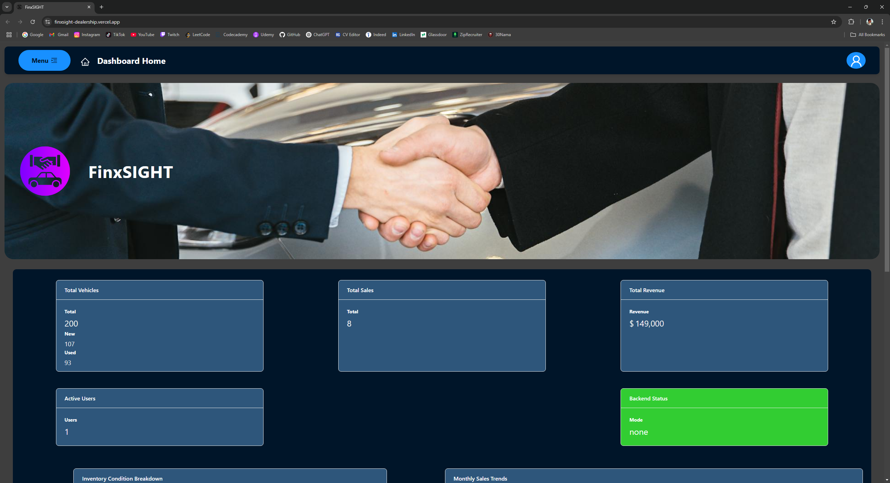

#

FinxSight Dealership

> FinxSight Dealership Dashboard
>
> <!--Live demo [_here_]().  If you have the project hosted somewhere, include the link here. -->

## Table of Contents

- [General Info](#general-information)
- [Technologies Used](#technologies-used)
- [Screenshots](#screenshots)
- [Usage](#usage)
- [Project Status](#project-status)
- [Room for Improvement](#room-for-improvement)
- [Acknowledgements](#acknowledgements)
- [Contact](#contact)
<!-- * [License](#license) -->

## General Information

A Dashboard to display and manipulate data from Finx's backend server. Came up with the name by combining the actual company name (Finx) with the word oversight which comes to mind when you are thinking of a dashboard that gives you oversight on your data (Sight). The backend server was provided by Finx Software Technology Inc. and included many options for manipulating the semi-persistent data which is stored on a SQLite Database. The goal is to showcase my technical skills, creativity, and approach to real-world problem-solving.

- This Repo includes the most Up-to-date Post-Deployment version of the code.

- The Pre-Deployment Repo can be viewed at: https://github.com/behi22/FinxSight

<!-- You don't have to answer all the questions - just the ones relevant to your project. -->

## Technologies Used

- npm - 8.15.0
- React.js - 18.2.0
- Redux - 8.0.2
- antd - 5.23.3
- HTML - version html5
- CSS
- TypeScript
- babel
- Axios - 1.7.9
- AJAX
- git version 2.38.1.windows.1
- github
- SQLite
- Vercel
- Postman

## Screenshots

## Usage

**Layout**: Initial layout of the project was sketched by using Figma: [Link](https://www.figma.com/design/xGLWBHIxSbcHrUtf2euZJT/Finx-Project?node-id=0-1&p=f&t=dqJ3aLbKgrETSlXT-0)

The app should have the following features:

- **Dashboard Home** - Neat and User-Friendly component based Frontend, created with React, Redux, and TypeScript, and deployed using Vercel. Shows the General Data and has Quick Actions for data manipulation and an easy-to-use navigation menu.
- **Settings Page** - Settings management page for Database File Management, Fail Mode Selection, and Reset Database Option.
- **User Management Page** - Data display and manipulation page for the app's users. (admin and user mode for future purposes)
- **Inventory Management Page** - Data display and manipulation page for vehicle inventory.
- **Sales Management Page** - Data display and manipulation page for dealership sales.
- **Dark Mode** - Located on the Footer, able to effectively change the lighting of the entire app.
- Effective integration of Frontend components manipulating and displaying Backend Data.

## Project Status

Project is: 75% Complete (Demo)

## Room for Improvement

- As indicated in the comments in [User.tsx](/src/pages/User.tsx), This page should only give you options for editing your own info if you are not an admin!

- The CSS needs to be worked on extensively in order to make the app more mobile-friendly, especially for the Footer and Page components.

- The [Settings](/src/pages/Settings.tsx), [Sales](/src/pages/Sales.tsx), and [Inventory](/src/pages/Inventory.tsx) pages are still under construction.

## Acknowledgements

- Many thanks to Finx Software Technology Inc. for including me in their Full Stack Developer assessment project.

## Contact

Created by Behbod Babai - feel free to contact me via email!
my email: behibabai@gmail.com

<!-- Optional -->
<!-- ## License -->
<!-- This project is open source and available under the [... License](). -->

<!-- You don't have to include all sections - just the one's relevant to your project -->
